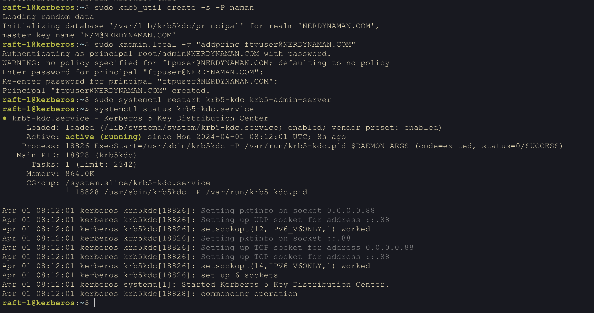
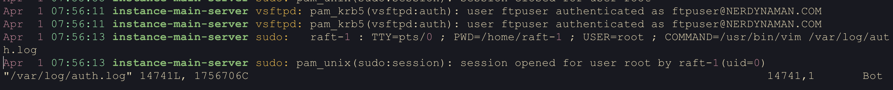
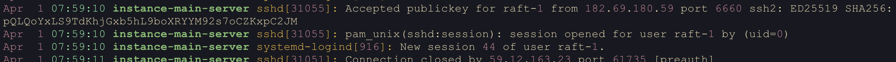



## Introduction

We will setup a FTP server and use kerberos for authentication. We will use `vsftpd` as the FTP server and `kerberos` for authentication. We will use `lftp` to login to the FTP server and test the kerberos authentication.


## Setting up FTP server
First we install `vsftpd` package:
=== "bash"
    ```bash
    sudo apt-get install vsftpd
    ```

Now we start the service:
=== "bash"
    ```bash
    sudo systemctl start vsftpd
    sudo systemctl enable vsftpd
    ```

Now we can create a new user for FTP:
=== "bash"
    ```bash
    sudo adduser -m -d /home/ftpuser -s /bin/bash ftpuser
    ```

Now we edit the configuration file `/etc/vsftpd.conf` to enable TLS-encryption for FTP:
=== "bash"
    ```bash
    sudo nano /etc/vsftpd.conf
    ```

Add the following lines to the configuration file:

=== "vsftpd Configuration file"

    ```conf
    # Enable write access
    write_enable=YES
    # User shouldnt be able to login without authentication
    anonymous_enable=NO
    # Not allowing users that dont support SSL
    allow_anon_ssl=NO
    ssl_enable=YES
    force_local_data_ssl=YES
    force_local_logins_ssl=YES
    # Disabling SSLv2 and SSLv3, allowing only TLSv1
    ssl_tlsv1=YES
    ssl_sslv2=NO
    ssl_sslv3=NO
    rsa_cert_file=/etc/ssl/certs/encryptCert.pem
    rsa_private_key_file=/etc/ssl/private/encryptCert.key
    # For enabling pam authentication
    pam_service_name=vsftpd
    ```

For generating the certificate we can use the following commands:
=== "Certificate"
    ```bash
    sudo openssl req -x509 -nodes -days 365 -newkey rsa:2048 -keyout /etc/ssl/private/encryptCert.key -out /etc/ssl/certs/encryptCert.pem
    ```

Now again restart the service:

```bash
sudo systemctl restart vsftpd
```

Now to test the above settings we will first use `ftp` and then `lftp`:

=== "bash"
    ```bash
    raft-1@instance-5:~$ ftp 10.190.0.8
    Connected to 10.190.0.8.
    220 (vsFTPd 3.0.5)
    Name (10.190.0.8:raft-1): ftpuser
    530 Non-anonymous sessions must use encryption.
    Login failed.
    421 Service not available, remote server has closed connection
    ```

As we can see the login failed because we did not use encryption. Now we will use `lftp` to login. We also first need to update `~/.lftprc` to not verify the certificate as we are using self-signed certificate:

=== "lftp Configuration file"

    ```bash
    set ssl:verify-certificate no
    ```

Now we will use `lftp` to login:

=== "bash"

    ```bash
    raft-1@instance-5:~$ lftp 10.190.0.8
    lftp 10.190.0.8:~> ftpuser
    Unknown command `ftpuser'.
    lftp 10.190.0.8:~> login ftpuser
    Password:
    lftp ftpuser@10.190.0.8:~> ls
    -rw-rw-r--    1 1002     1003            6 Mar 31 17:33 ok
    drwxrwxr-x    2 1002     1003         4096 Mar 31 12:14 tu
    lftp ftpuser@10.190.0.8:~>
    ```

## Setting up kerberos

Now on a different machine we will setup kerberos:

### Installing kerberos

=== "bash"
    ```bash
    sudo apt-get install krb5-kdc krb5-admin-server
    ```

### Modifying Config file

Modifying the configuration file `/etc/krb5.conf`:

=== "krb5 Server Configuration file"
    ```conf
    [libdefaults]
        default_realm = NERDYNAMAN.COM
        dns_lookup_realm = false
        dns_lookup_kdc = false

    [realms]
        NERDYNAMAN = {
            kdc = 10.190.0.7
            admin_server = 10.190.0.7
        }

    [domain_realm]
        .nerdynaman  = NERDYNAMAN.COM
        nerdynaman = NERDYNAMAN.COM
    ```

### Creating the database

Initialize the database:
=== "bash"
    ```bash
    raft-1@kerberos:~$ sudo kdb5_util create -s -P naman
    Loading random data
    Initializing database '/var/lib/krb5kdc/principal' for realm 'NERDYNAMAN.COM',
    master key name 'K/M@NERDYNAMAN.COM'
    raft-1@kerberos:~$ sudo kadmin.local -q "addprinc ftpuser@NERDYNAMAN.COM"
    Authenticating as principal root/admin@NERDYNAMAN.COM with password.
    WARNING: no policy specified for ftpuser@NERDYNAMAN.COM; defaulting to no policy
    Enter password for principal "ftpuser@NERDYNAMAN.COM":
    Re-enter password for principal "ftpuser@NERDYNAMAN.COM":
    Principal "ftpuser@NERDYNAMAN.COM" created.
    raft-1@kerberos:~$ sudo systemctl restart krb5-kdc krb5-admin-server
    raft-1@kerberos:~$ systemctl status krb5-kdc.service
    ```



## Setting us Kerberos client on FTP server

### Installing kerberos client

Now we will setup kerberos client on the FTP server:
=== "bash"
    ```bash
    sudo apt-get install krb5-user
    ```

### Configuring the client kerberos configuration file

In our case client is the FTP server.

Now we will modify the configuration file `/etc/krb5.conf`:
=== "krb5 client Configuration file"
    ```conf
    [libdefaults]
        default_realm = NERDYNAMAN.COM
        dns_lookup_realm = false
        dns_lookup_kdc = false

    [realms]
        NERDYNAMAN = {
            kdc = 10.190.0.7
            admin_server = 10.190.0.7
        }

    [domain_realm]
        .nerdynaman  = NERDYNAMAN.COM
        nerdynaman = NERDYNAMAN.COM
    ```

### Getting a ticket

Obtain a ticket for the user:
=== "bash"
    ```bash
    kinit ftpuser
    klist
    ```

### Configuring PAM

Now we will confifure PAM to use kerberos, modify `/etc/pam.d/vsftpd`:
=== "PAM Configuration file"
    ```conf
    account required    pam_krb5.so
    auth    required    pam_krb5.so
    ```

Now we will restart the service:
=== "bash"
    ```bash
    sudo systemctl restart vsftpd
    ```

## Testing the setup

Now we will test the setup using `lftp`:

=== "bash"
    ```bash
    raft-1@instance-5:~$ lftp 10.190.0.8
    lftp 10.190.0.8:~> login ftpuser
    Password:
    lftp ftpuser@10.190.0.8:~> ls
    -rw-rw-r--    1 1002     1003            6 Mar 31 17:33 ok
    drwxrwxr-x    2 1002     1003         4096 Mar 31 12:14 tu
    ```

On the FTP server we can see the following logs:

=== "/var/log/auth.log"
    ```bash
    Apr  1 07:56:11 instance-main-server vsftpd: pam_krb5(vsftpd:auth): user ftpuser authenticated as ftpuser@NERDYNAMAN.COM
    Apr  1 07:56:11 instance-main-server vsftpd: pam_krb5(vsftpd:auth): user ftpuser authenticated as ftpuser@NERDYNAMAN.COM
    Apr  1 07:56:13 instance-main-server sudo:   raft-1 : TTY=pts/0 ; PWD=/home/raft-1 ; USER=root ; COMMAND=/usr/bin/vim /var/log/auth.log
    ```




Still if we try to ssh into the server we will be using the unix authentication:
=== "/var/log/auth.log"
    ```bash
    Apr  1 07:59:10 instance-main-server sshd[31055]: Accepted publickey for raft-1 from 182.69.180.59 port 6660 ssh2: ED25519 SHA256:pQLQoYxLS9TdKhjGxb5hL9boXRYYM92s7oCZKxpC2JM
    Apr  1 07:59:10 instance-main-server sshd[31055]: pam_unix(sshd:session): session opened for user raft-1 by (uid=0)
    Apr  1 07:59:10 instance-main-server systemd-logind[916]: New session 44 of user raft-1.
    ```



We can see that the user `ftpuser` was authenticated using kerberos.
## Resources

- [vsftpd setup](https://phoenixnap.com/kb/install-ftp-server-on-ubuntu-vsftpd)
- [enable TLS encryption](https://reintech.io/blog/install-configure-ftps-server-vsftpd-centos-9)
