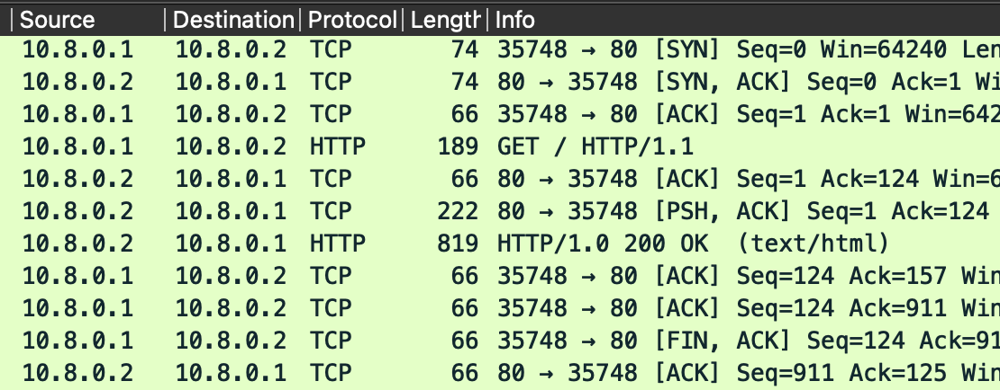

## Setup

### Description
The setup consists of three VMs, one acting as a firewall, second as a web server and third as a client. The firewall will be running `PF` and will be configured to allow access to the web server from the client. The web server will be running `python -m http.server` and will be serving a simple web page. The client will be running `curl` to access the web page from the web server.

### Basic VM configuration
- VMs have their network interfaces configured to **host only** mode.
- VM1 [**Client**] and VM3[**Webserver**] are configured with 1 CPU, 1024 MB RAM, 1 network interface and Ubuntu.
- VM2 has 2 network interfaces and runs on top of FreeBSD with other configurations same as VM1 and VM3.

- - The first network interface has a public IP address which can be accessed by clients/external network to visit the web server.

- - The second network interface has a private IP address and is there for the **firewall** to access the web server. Web servers and other services which are to be accessed by users are behind the firewall so shouldnt be accessible from outside without going through the firewall.

- For experiment purposes, we will be using the following Network Configuration:
    - VM1 [**Client**] - 
        - Interface 1 [**Public IP**]: **10.8.0.1**
```bash 
sudo ifconfig <interfaceName> 10.8.0.1/24
```
<!-- {: style="height:300px;width:700px"} -->

    - VM2 [**Firewall**] -
        - Interface 1 [**Public IP**]: **10.8.0.2**
        - Interface 2 [**Private IP**]: **10.8.1.2**
```bash 
sudo ifconfig <interface1Name> 10.8.0.2/24
sudo ifconfig <interface2Name> 10.8.1.2/24
```
<!-- {: style="height:300px;width:700px"} -->

    - VM3 [**Webserver**] -
        - Interface 1 [**Private IP**]: **10.8.1.1**        
```bash
sudo ifconfig <interfaceName> 10.8.1.1/24
```
<!-- {: style="height:300px;width:700px"} -->

Above configuration depicts that client and one interface of firewall are in the same network and the other interface of firewall and webserver are in the same network. The firewall will be used to route the traffic from client to webserver.

## Testing the basic setup
We have two different subnets in our setup, for the meanwhile we will try to make the VMs communicate with each other across the subnets. We will try to ping the VM3 from VM1 and vice versa. For this as we know VM2 is present in both the subnets so we will use it as a router to route the traffic from one subnet to another.
<br><br>
We will also enable **IPv4 forwarding** on the VM2 so that it can route the traffic from one subnet to another. Now we will make routing entries in VM1 and VM3 so that traffic for the other subnet goes through the VM2. Now we try to access the VM3 from the VM1 using `ping`. If the ping is successful, then the setup is working fine and we can proceed to the next step.

- On VM1 : <br>
We need to change default gateway for accessing the VM3 to the VM2s interface 1 IP address so that the traffic goes through the VM2.
```bash
sudo ip route add 10.8.1.0/24 via 10.8.0.2
// so that the traffic goes through the VM2 
ping 10.8.0.2
```
<!-- {: style="height:300px;width:700px"} <br> -->
We can also see the trace of the ping command from VM1 to VM3 using the following command:
```bash
traceroute 10.8.1.1
```
<!-- {: style="height:100px;width:700px"} -->

- On VM2 :
```bash
// enable IPv4 forwarding on the VM2
sudo sysctl net.inet.ip.forwarding=1 
ping 10.8.0.1
ping 10.8.1.1
```
<!-- {: style="height:300px;width:700px"} -->

- On VM3 :
```bash
sudo ip route add 10.8.0.0/24 via 10.8.1.2
// so that the response to any traffic goes through the VM2
ping 10.8.1.2
```
<!-- {: style="height:300px;width:700px"} -->

## Firewall Setup
We have successfully tested the basic setup and also VMs are able to communicate with each other. But the traffic is not being filtered by the firewall and also the firewall is allowing direct access to the web server from the client. We shall now configure the firewall such that client accesses the web server on public IP of the firewall i.e. VM2 interface1. Such that web server will see the connection coming from the firewall and not the client. Similarly, the client will see the response coming from the firewall and not the web server.

### PF Configuration
For configuring the PF, we need to edit the `/etc/pf.conf` file. If this file is not present, we can create it. We will be adding the following rules to the file:
```bash
# adding entries for doing DNAT
rdr pass on vtnet0 proto tcp to any port 80 -> 10.8.1.1 port 80
rdr pass on vtnet0 proto tcp to any port 443 -> 10.8.1.1 port 443
# adding entries for doing SNAT
nat on vtnet1 from 10.8.0.1 to any -> (vtnet1)
# allowing the traffic to the web server
pass out on vtnet0 proto tcp from port 80 to 10.8.1.1 port 80
pass out on vtnet0 proto tcp from port 443 to 10.8.1.1 port 443
# now blocking the direct traffic from the client to the web server
block in on vtnet0 proto tcp from any to 10.8.1.1 port {80, 443}
block in on vtnet0 proto tcp from any to 10.8.1.2 port {80, 443}
# Or
block in on vtnet0 proto tcp from any to 10.8.1.0/24 port {80, 443}
```

Now add following lines to the `/etc/rc.conf` file to enable the PF:
```bash
pf_enable=yes
pf_rules="/etc/pf.conf"
gatway_enable="YES"
```
Now we need to reload the PF using the following command:
```bash
sudo pfctl -e 
sudo pfctl -f /etc/pf.conf
```
We can verify the nat and rdr rules using the following command:
```bash
sudo pfctl -s nat
```

<!-- {: style="height:100px;width:700px"} -->

### Setting up the web server

Now our firewall is configured and we can test the setup by accessing the web server from the client. Firstly for setting up the web server, we will be running the following command on the VM3:
```bash
python3 -m http.server 80
```

<!-- {: style="height:250px;width:900px"} -->

### Testing the final setup
Now we will try to access the web server from the client using the following command:

wget 10.8.0.2
wget 10.8.1.1 //to verify if access is blocked


<!-- {: style="height:170px;width:900px"} -->

We can also verify access from firewall is also blocked from any other port such as 22 using the following command:
```bash
ssh naman@10.8.1.1
```

<!-- {: style="height:120px;width:700px"} -->

Above screen shot was taken prior to the configuration of the firewall.
<br>

<!-- {: style="height:40px;width:700px"} -->

After the configuration of the firewall, the access is blocked.

## Network packet capture

We can also verify the working of the firewall by capturing the packets using the `tcpdump` command. We can use the following command to capture the packets:
```bash
sudo tcpdump -i <interfaceName> -w output.pcap
```
We captured the packets on the VM1, both interface of VM2 and VM3.

- VM1

<!-- {: style="height:150px;width:800px"} -->

VM1 is able to access the web server using the public IP of the firewall.

- VM2 interface 1

<!-- {: style="height:150px;width:800px"} -->

VM2 on interface 1 is able to see the traffic coming from and going to the client.

- VM2 interface 2

<!-- {: style="height:150px;width:800px"} -->

VM2 on interface 2 is able to see the traffic coming from and going to the web server.


- VM3

<!-- {: style="height:150px;width:800px"} -->

VM3 is able to see the traffic coming from and going to the firewall in the internal network.


## Behind the scenes
Let us understand the basic things involved in the working of the firewall. Let us first look into netfilter.
### Hook Functions

They are used to define the behavior of how will the packet be processed.

- **PREROUTING** 

- **INPUT**

- **FORWARD**

- **OUTPUT**

- **POSTROUTING**


```
  A[Network] -->|PREROUTING| B{Routing Decision};
    B -->|INPUT| C[Process];
    B -->|FORWARDING| E;
    C -->|OUTPUT| D{Routing Decision};
    D -->|POSTROUTING| E[Network];
```


### NetFilter
**NetFilter** is a framework that provides these hooks to the kernel. **iptables** and **nftables** uses these hooks to define the behavior of the packet.<br> There are also **chains** used in the iptables and nftables to define the behavior of the packet. The chains are nothing but the list of rules that are to be applied at a hook.<br> There are various **tables** such as **filter**, **nat**, **mangle** etc. which provide these rules and are used to define the behavior of the packet at a particular hook. 

#### Diff in iptables and nftables

- Default chains and tables are available in the iptables.
- In nftables, we have to define the tables and chains and then define the rules for the chains.
- nftables allow us to define multiple actions in a single rule, which is not possible in iptables.

### FreeBSD PF
FreeBSD has three type of firewalls: **IPFW**, **PF** and **IPF**. We will be further discussing about **PF**. 


## References
- [all-about-iptables-nftables-pf](https://iceburn.medium.com/compare-firewalld-iptables-nftables-netfilter-de08a8d21b5b)
- [pf-docs](https://docs.freebsd.org/en/books/handbook/firewalls/)