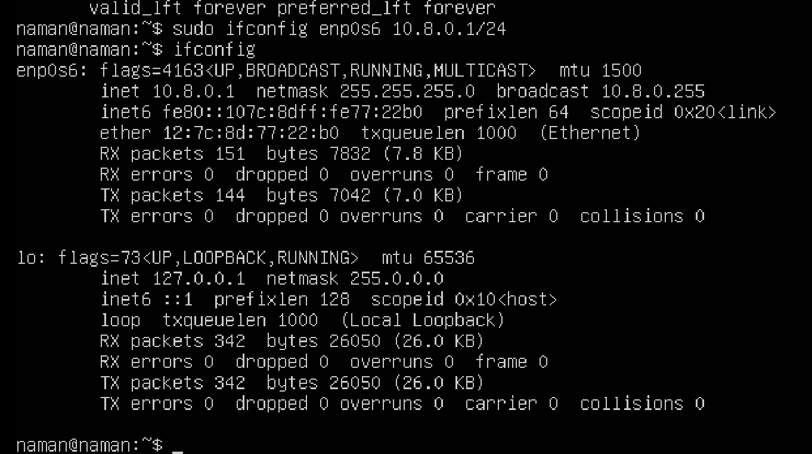
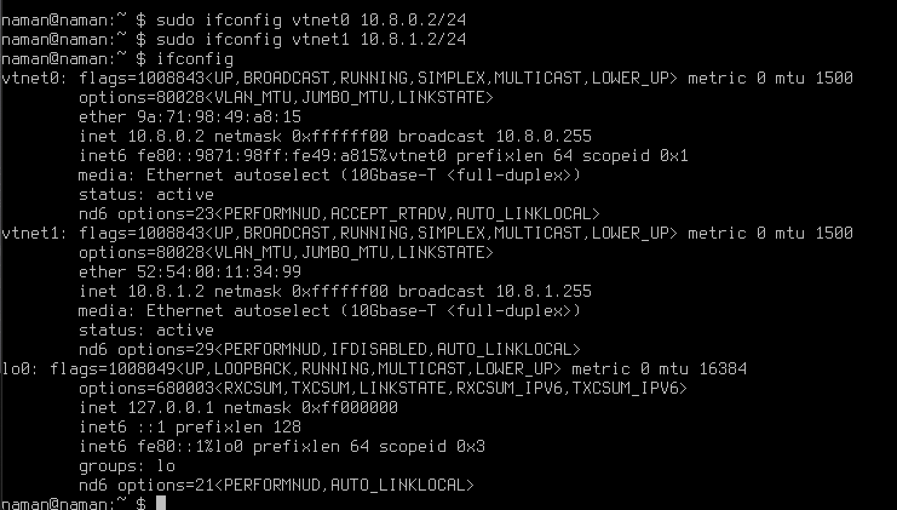

### Description
The setup consists of three VMs, one acting as a firewall, second as a web server and third as a client. The firewall will be running `PF` and will be configured to allow access to the web server from the client. The web server will be running `python -m http.server` and will be serving a simple web page. The client will be running `curl` to access the web page from the web server.

### Basic VM configuration
- VMs have their network interfaces configured to **host only** mode.
- VM1 [**Client**] and VM3[**Webserver**] are configured with 1 CPU, 1024 MB RAM, 1 network interface and Ubuntu.
- VM2 has 2 network interfaces and runs on top of FreeBSD with other configurations same as VM1 and VM3.

- - The first network interface has a public IP address which can be accessed by clients/external network to visit the web server.

- - The second network interface has a private IP address and is there for the **firewall** to access the web server. Web servers and other services which are to be accessed by users are behind the firewall so shouldnt be accessible from outside without going through the firewall.

- For experiment purposes, we will be using the following Network Configuration:
    - VM1 [**Client**] - 
        - Interface 1 [**Public IP**]: **10.8.0.1**
```bash 
sudo ifconfig <interfaceName> 10.8.0.1/24
```
{: style="height:300px;width:700px"}

    - VM2 [**Firewall**] -
        - Interface 1 [**Public IP**]: **10.8.0.2**
        - Interface 2 [**Private IP**]: **10.8.1.2**
```bash 
sudo ifconfig <interface1Name> 10.8.0.2/24
sudo ifconfig <interface2Name> 10.8.1.2/24
```
{: style="height:300px;width:700px"}

    - VM3 [**Webserver**] -
        - Interface 1 [**Private IP**]: **10.8.1.1**        
```bash
sudo ifconfig <interfaceName> 10.8.1.1/24
```
{: style="height:300px;width:700px"}

Above configuration depicts that client and one interface of firewall are in the same network and the other interface of firewall and webserver are in the same network. The firewall will be used to route the traffic from client to webserver.

## Testing the basic setup
We have two different subnets in our setup, for the meanwhile we will try to make the VMs communicate with each other across the subnets. We will try to ping the VM3 from VM1 and vice versa. For this as we know VM2 is present in both the subnets so we will use it as a router to route the traffic from one subnet to another.
<br><br>
We will also enable **IPv4 forwarding** on the VM2 so that it can route the traffic from one subnet to another. Now we will make routing entries in VM1 and VM3 so that traffic for the other subnet goes through the VM2. Now we try to access the VM3 from the VM1 using `ping`. If the ping is successful, then the setup is working fine and we can proceed to the next step.
