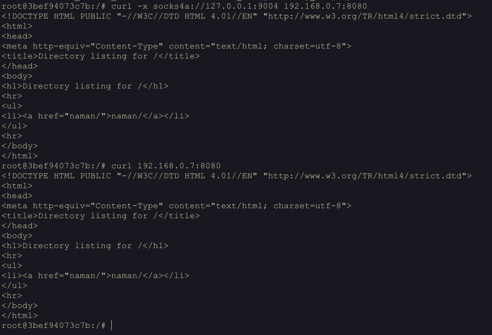
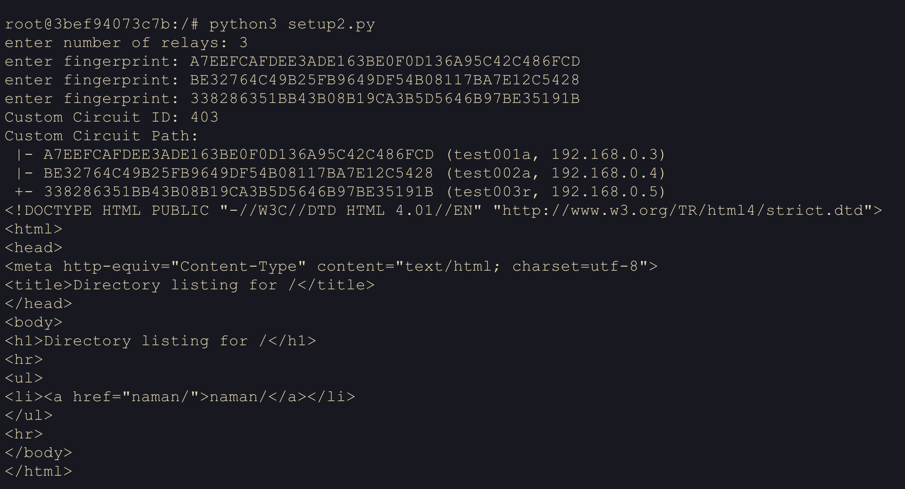
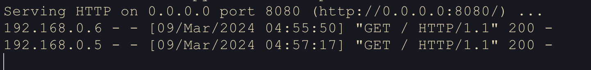
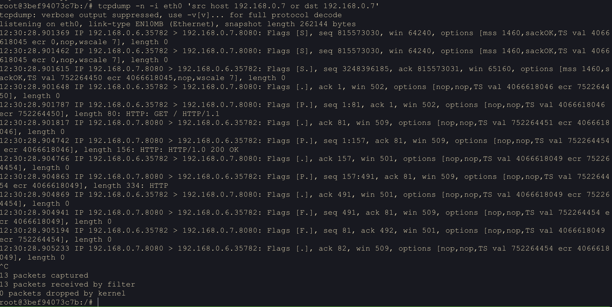
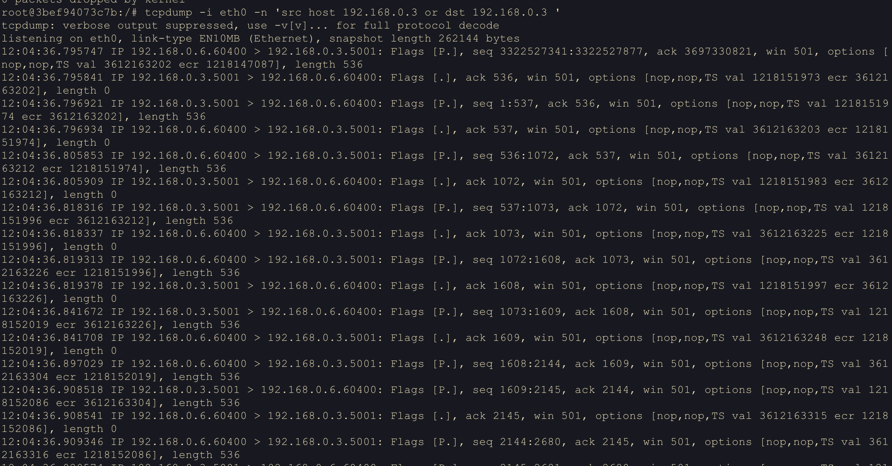
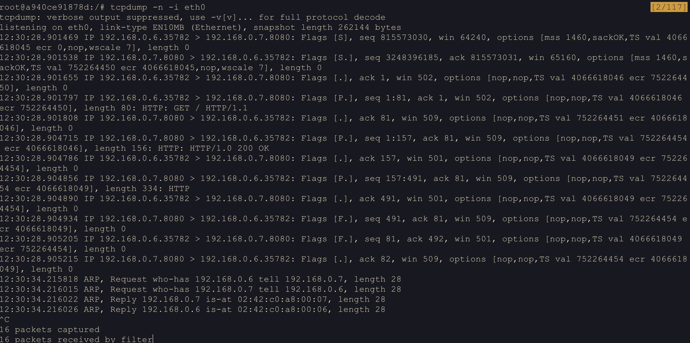
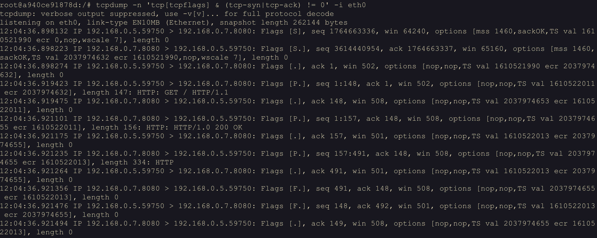
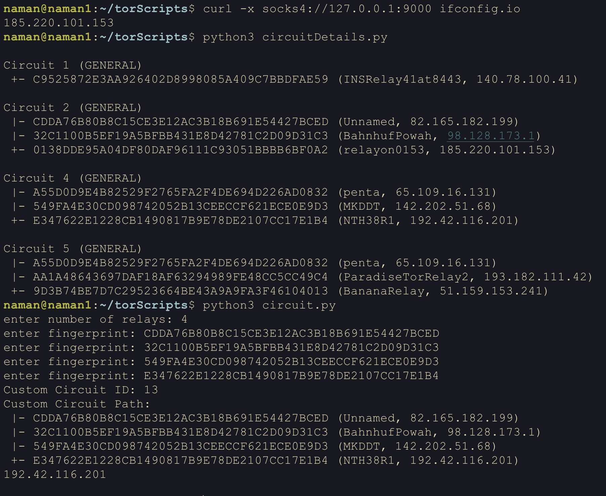
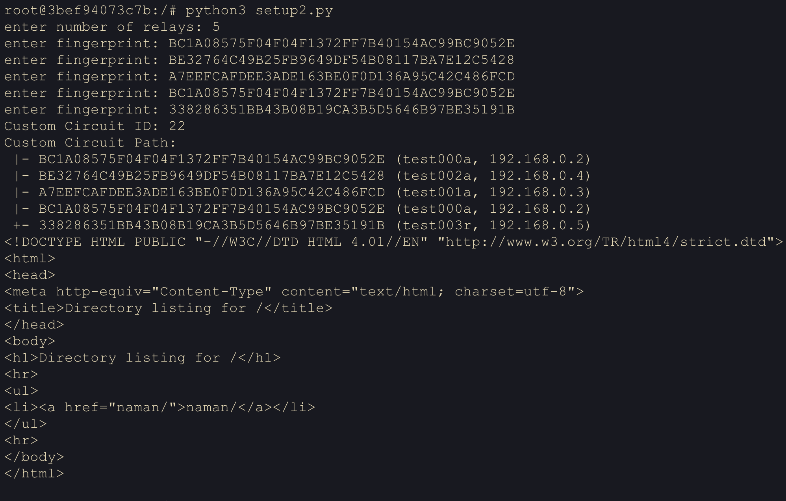
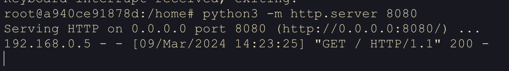

We will setup a private tor network with 3 relays, 1 exit node, 1 client and 1 server. We will use `chutney` to generate torrc files for the relays and then use the torrc files to setup the tor relays. We will then use the client to fetch the webpage hosted on the server first without tor and then through the tor network. We will also see the network traffic between the client and the server with and without tor.


## Machine setup

### Using VMs
We use **6** VMs for setting up the private tor network. The VMs are setup as follows:

- **1-3** VM for the **directory authority** and hosting **relays**

	* relays refer to set of gaurd and middle node so any client can choose a relay as gaurd or middle node
	* for setting up a minimal network with 3 tor relays including exit we still need 4 VMs if we also want to host our own directory authority due to the reason, a client cant choose a node as relay in its setup if it using it as directory authority.
	
- **4** VM for the **exit node**
- **5** VM for the **client**
- **6** VM for the **server**

- All VMs are configured with thier subnet as `192.168.0.0/24` and the VMs are assigned the following IP addresses:

	- **VM1**: `192.168.0.2`
	- **VM2**: `192.168.0.3`
	- **VM3**: `192.168.0.4`
	- **VM4**: `192.168.0.5`
	- **VM5**: `192.168.0.6`
	- **VM6**: `192.168.0.7`

- For allocating static IP addresses to the VMs, we can use the following command:

	```bash
	sudo ifconfig eth0 <ip_addr>/<subnet> 
	```

- VMs networking should be configured such that they can communicate with each other. On `virtualbox` we can use `host-only` or `NAT` network for this purpose, preferably `host-only` network so that any outside network connection is not possible.

`Either VMs could be used or docker also works fine for setting up the network.`

### Using Docker

- All the commands for docker should be run from the directory [tor-docker](./images/tor-docker.zip).

- Infra as in number of machines and their roles remain same here also.

	```bash
	docker build -t alpine_test .
	docker compose up -d --build
	```

- If you want to access any container from the host machine, you can use the following command:

	```bash
	docker exec -it <container_id> bin/bash
	```

- Since containers running tor relays start as soon as containers are live so their logs can be seen using the following command:

	```bash
	docker compose logs | grep <container_id>
	```

- `Dockerfile` and `docker-compose.yml` are attached along with and their required explanation is also provided in them in form of comments.

	[Compose file](./images/docker-compose.yaml), [Dockerfile](./images/Dockerfile)


## Setting up tor relays


In order to setup the private tor network, we need to configure the `torrc` file for each VM. The `torrc` file is located at `/etc/tor/torrc`. Information like client, gaurd, middle and exit node, directory authority, etc. are configured in this file.

### Using chutney to generate torrc files

Following configs were inspired from chutney's torrc files. Chutney helps in setting up a minimal tor network on localhost for testing purposes. In base_dir of chutney we can find chutney config file inside `chutney/net` directory. We need to modify this to tell chutney how many relays/gaurds/middle/exit/clients we want to setup and then run the following commands to generate torrc files.

```bash
git clone https://git.torproject.org/chutney.git
cd chutney
./chutney configure networks/basic
./chutney start networks/basic
./chutney verify networks/basic
```

After above commands, we can find the torrc files in `chutney/net/nodes/` directory.

Since these torrc are for localhost, we need to modify them to work with our VMs. 

### torrc files for VMs

[torrcRelayA](./images/torrcA), [torrcRelayB](./images/torrcB), [torrcRelayC](./images/torrcC), [torrcExit](./images/torrcD), [torrcClient](./images/torrcE)

Here is detailed explanation of all the configurations required for various relays in the `torrc` file, specifics are mentioned in respective `torrc` files.

```conf
TestingTorNetwork 1
# TestingTorNetwork 1 tells tor to use the TestingDirAuthVoteGuard and TestingMinExitFlagThreshold options
# TestingDirAuthVoteGuard * tells tor to vote for all relays as guards
# TestingMinExitFlagThreshold 0 tells tor to give all relays the Exit flag
# These options are only available when TestingTorNetwork is set to 1

# We need at least 3 descriptors to build circuits.
# In a 3 relay network, 0.67 > 2/3, so we try hard to get 3 descriptors.
# In larger networks, 0.67 > 2/N, so we try hard to get >=3 descriptors.
PathsNeededToBuildCircuits 0.67
# below options are set to avoid Guard stability requirements
TestingDirAuthVoteExit *
TestingDirAuthVoteHSDir *
# For speeding up the consensus cycle, here vote is valid for 2 hours
V3AuthNIntervalsValid 2

# avoiding Guard stability requirements
TestingDirAuthVoteGuard *
# avoiding Exit bandwidth requirements
TestingMinExitFlagThreshold 0

# data directory for tor node
DataDirectory /torDir
# connlimit sets the maximum number of simultaneous connections that this relay will allow
ConnLimit 60
Nickname test000a
# Let tor close connections gracefully before exiting
ShutdownWaitLength 2
# helps us to attach and test the tor process in private network
DisableDebuggerAttachment 0

# ControlPort is used to control tor process from stem scripts, useful option for client
ControlPort 8000

# shows warnings for protocol violations
ProtocolWarnings 1
# Log all messages including severity 'notice' or higher
SafeLogging 0
# Log messages at the very high frequency in our case millisecond
LogTimeGranularity 1

# This is very important option, it tells tor to use the given directory authority as the authority for the network to get status/information about relays of the network and also upload our relay's information to the authority
# test000a is the nickname of the directory authority
# orport is the port on which the directory authority is listening for connections
# v3ident is the identity key of the directory authority
# address is the IP address of the directory authority
# last option is the fingerprint of the directory authority
# here we use 3 directory authorities i.e. odd number of authorities so that at any time majority of them have consensus and dont have half split consensus
# process of generation of v3ident and node fingerprint is mentioned below
DirAuthority test000a orport=5000 no-v2 v3ident=387760FC480CF6AA92D5F341E013FB208EC8FD19 192.168.0.2:7000 BC1A08575F04F04F1372FF7B40154AC99BC9052E
DirAuthority test001a orport=5001 no-v2 v3ident=812A1F8C5C2719EA2FA4D547B4E15A985A9B6B00 192.168.0.3:7001 A7EEFCAFDEE3ADE163BE0F0D136A95C42C486FCD
DirAuthority test002a orport=5002 no-v2 v3ident=BD88184E3FB42563A32A5127D215B343AEC6D759 192.168.0.4:7002 BE32764C49B25FB9649DF54B08117BA7E12C5428

# SocksPort is the port on which tor listens for connections from clients if using it as a client otherwise mention 0 to disable it
SocksPort 0
# ORPort is the port on which tor listens for connections from other relays
OrPort 5000
# address on which tor listens for connections from other relays
Address 192.168.0.2

# exit nodes need to keep this as 1 otherwise every other node should keep it as 0
ExitRelay 0


# options regarding the dns resolution for tor node
ServerDNSDetectHijacking 0
ServerDNSTestAddresses
# tor will use this file to resolve DNS queries in this case none
ServerDNSResolvConfFile /dev/null
# authority directory if exits on this node then will listen on this port
DirPort 7000

# marks the relay as a authority directory
AuthoritativeDirectory 1
# version of the authority directory
V3AuthoritativeDirectory 1
# contact info for the authority directory
ContactInfo auth0@test.test

# for testing enviorment assuming all relays are reachable
AssumeReachable 1

# V3AuthVotingInterval and TestingV3AuthInitialVotingInterval can be:
#   10, 12, 15, 18, 20, ...
# TestingV3AuthInitialVotingInterval can also be:
#    5, 6, 8, 9
# They both need to evenly divide 24 hours.

# Initial Vote + Initial Dist must be less than Initial Interval
# time btw votes made by authority directory
TestingV3AuthInitialVotingInterval 20
# delay before voting after consesus is reached
TestingV3AuthInitialVoteDelay 4
# delay before distributing consesus after voting
TestingV3AuthInitialDistDelay 4
# Vote + Dist must be less than Interval/2, because when there's no consensus,
# tor uses Interval/2 as the voting interval.
# for normal authority directory
V3AuthVotingInterval 20
V3AuthVoteDelay 4
V3AuthDistDelay 4

# specifying algorithm for consensus
ConsensusParams cc_alg=2

# for exit nodes incoming and outgoing traffic parameters are set such as 
# helps in accepting incoming traffic for private network
ExitPolicy accept 127.0.0.0/8:*
# doesnt reject private network traffic
ExitPolicyRejectPrivate 0
ExitPolicy accept private:*
# accept all ipv4 traffic
ExitPolicy accept *:*
```

### Steps to generate V3ident and V3Author

For relays with authority directory as mentioned above, we need to generate V3ident and relay fingerprint. We can use the following commands from `base_dir` mentioned in torrc to generate them.


```bash
cd base_dir
mkdir keys && cd keys
tor-gencert --create-identity-key -a {ip_addr}:{port_number}
# this is v3ident
cat authority_certificate | grep fingerprint
```	

Important to remember, once you get the v3ident start the tor process and then stop it, then only the fingerprint will be generated.

```bash
cat ../fingerprint
```
### Running tor process

Now torrc file is ready for the relay to be setup. We can use the following command to start the tor process. On docker, tor process starts as soon as the container is live by default.

```bash
tor -f /etc/tor/torrc
```

## Experimenting with the private tor network

### Client

We use curl to fetch the webpage hosted on server **VM6** first without tor and secondly through the tor network.

Server can easily be setup using the following command:

```bash
python3 -m http.server 8080
```

#### Without tor

```bash
root@3bef94073c7b:/# curl 192.168.0.7:8080
<!DOCTYPE HTML PUBLIC "-//W3C//DTD HTML 4.01//EN" "http://www.w3.org/TR/html4/strict.dtd">
<html>
<head>
<meta http-equiv="Content-Type" content="text/html; charset=utf-8">
<title>Directory listing for /</title>
</head>
<body>
<h1>Directory listing for /</h1>
<hr>
<ul>
<li><a href="naman/">naman/</a></li>
</ul>
<hr>
</body>
</html>
```
#### With tor

```bash
root@3bef94073c7b:/# curl -x socks4a://127.0.0.1:9004 192.168.0.7:8080
<!DOCTYPE HTML PUBLIC "-//W3C//DTD HTML 4.01//EN" "http://www.w3.org/TR/html4/strict.dtd">
<html>
<head>
<meta http-equiv="Content-Type" content="text/html; charset=utf-8">
<title>Directory listing for /</title>
</head>
<body>
<h1>Directory listing for /</h1>
<hr>
<ul>
<li><a href="naman/">naman/</a></li>
</ul>
<hr>
</body>
</html>
```

`curl -x socks4a://{ip_addr}:{port} {url}` here -x is used to specify the proxy and socks4a is the protocol used for the proxy, {ip_addr} and {port} are the ip address and port of the tor relay and {url} is the url of the webpage to be fetched.

<!--  -->

[screenshot](./images/clientCurl.png)

We can also try to fetch the webpage using by setting up custom tor circuit and attaching the stream to it using the script from previous part by changing the the url of webpage to `192.168.0.7:8080` and socks port to `9004` in the script.

```bash
root@3bef94073c7b:/# python3 setup2.py
enter number of relays: 3
enter fingerprint: A7EEFCAFDEE3ADE163BE0F0D136A95C42C486FCD
enter fingerprint: BE32764C49B25FB9649DF54B08117BA7E12C5428
enter fingerprint: 338286351BB43B08B19CA3B5D5646B97BE35191B
Custom Circuit ID: 403
Custom Circuit Path:
 |- A7EEFCAFDEE3ADE163BE0F0D136A95C42C486FCD (test001a, 192.168.0.3)
 |- BE32764C49B25FB9649DF54B08117BA7E12C5428 (test002a, 192.168.0.4)
 +- 338286351BB43B08B19CA3B5D5646B97BE35191B (test003r, 192.168.0.5)
<!DOCTYPE HTML PUBLIC "-//W3C//DTD HTML 4.01//EN" "http://www.w3.org/TR/html4/strict.dtd">
<html>
<head>
<meta http-equiv="Content-Type" content="text/html; charset=utf-8">
<title>Directory listing for /</title>
</head>
<body>
<h1>Directory listing for /</h1>
<hr>
<ul>
<li><a href="naman/">naman/</a></li>
</ul>
<hr>
</body>
</html>
```

<!--  -->

[screenshot](./images/clientCurlScript.png)

### Server

Logs from the server:

```bash
root@a940ce91878d:/home# python3 -m http.server 8080
Serving HTTP on 0.0.0.0 port 8080 (http://0.0.0.0:8080/) ...


192.168.0.6 - - [09/Mar/2024 05:11:46] "GET / HTTP/1.1" 200 -
192.168.0.5 - - [09/Mar/2024 05:12:39] "GET / HTTP/1.1" 200 -
```

`192.168.0.6` is the client and `192.168.0.5` is the exit node for private tor setup.

<!--  -->

[screenshot](./images/server.png)

## Network traffic

### Client
#### Without tor
```pcap
root@3bef94073c7b:/# tcpdump -n -i eth0 'src host 192.168.0.7 or dst 192.168.0.7'
tcpdump: verbose output suppressed, use -v[v]... for full protocol decode
listening on eth0, link-type EN10MB (Ethernet), snapshot length 262144 bytes
12:30:28.901369 IP 192.168.0.6.35782 > 192.168.0.7.8080: Flags [S], seq 815573030, win 64240
12:30:28.901462 IP 192.168.0.6.35782 > 192.168.0.7.8080: Flags [S], seq 815573030, win 64240
12:30:28.901615 IP 192.168.0.7.8080 > 192.168.0.6.35782: Flags [S.], seq 3248396185, ack 815573031, win 65160
12:30:28.901648 IP 192.168.0.6.35782 > 192.168.0.7.8080: Flags [.], ack 1, win 502
12:30:28.901787 IP 192.168.0.6.35782 > 192.168.0.7.8080: Flags [P.], seq 1:81, ack 1, win 502
12:30:28.901817 IP 192.168.0.7.8080 > 192.168.0.6.35782: Flags [.], ack 81, win 509
12:30:28.904742 IP 192.168.0.7.8080 > 192.168.0.6.35782: Flags [P.], seq 1:157, ack 81, win 509
12:30:28.904766 IP 192.168.0.6.35782 > 192.168.0.7.8080: Flags [.], ack 157, win 501
12:30:28.904863 IP 192.168.0.7.8080 > 192.168.0.6.35782: Flags [P.], seq 157:491, ack 81, win 509
12:30:28.904869 IP 192.168.0.6.35782 > 192.168.0.7.8080: Flags [.], ack 491, win 501
12:30:28.904941 IP 192.168.0.7.8080 > 192.168.0.6.35782: Flags [F.], seq 491, ack 81, win 509
12:30:28.905194 IP 192.168.0.6.35782 > 192.168.0.7.8080: Flags [F.], seq 81, ack 492, win 501
12:30:28.905233 IP 192.168.0.7.8080 > 192.168.0.6.35782: Flags [.], ack 82, win 509
^C
13 packets captured
13 packets received by filter
0 packets dropped by kernel
root@3bef94073c7b:/#
```
<!--  -->

[screenshot](./images/clientNetPac.png)

#### With tor
```plaintext
root@3bef94073c7b:/# tcpdump -i eth0 -n 'src host 192.168.0.3 or dst 192.168.0.3 '
tcpdump: verbose output suppressed, use -v[v]... for full protocol decode
listening on eth0, link-type EN10MB (Ethernet), snapshot length 262144 bytes
12:04:36.795747 IP 192.168.0.6.60400 > 192.168.0.3.5001: Flags [P.], seq 3322527341:3322527877, ack 3697330821, win 501
12:04:36.795841 IP 192.168.0.3.5001 > 192.168.0.6.60400: Flags [.], ack 536, win 501
12:04:36.796921 IP 192.168.0.3.5001 > 192.168.0.6.60400: Flags [P.], seq 1:537, ack 536, win 501
12:04:36.796934 IP 192.168.0.6.60400 > 192.168.0.3.5001: Flags [.], ack 537, win 501
12:04:36.805853 IP 192.168.0.6.60400 > 192.168.0.3.5001: Flags [P.], seq 536:1072, ack 537, win 501
12:04:36.805909 IP 192.168.0.3.5001 > 192.168.0.6.60400: Flags [.], ack 1072, win 501
12:04:36.818316 IP 192.168.0.3.5001 > 192.168.0.6.60400: Flags [P.], seq 537:1073, ack 1072, win 501
12:04:36.818337 IP 192.168.0.6.60400 > 192.168.0.3.5001: Flags [.], ack 1073, win 501
12:04:36.819313 IP 192.168.0.6.60400 > 192.168.0.3.5001: Flags [P.], seq 1072:1608, ack 1073, win 501
12:04:36.819378 IP 192.168.0.3.5001 > 192.168.0.6.60400: Flags [.], ack 1608, win 501
12:04:36.841672 IP 192.168.0.3.5001 > 192.168.0.6.60400: Flags [P.], seq 1073:1609, ack 1608, win 501
12:04:36.841708 IP 192.168.0.6.60400 > 192.168.0.3.5001: Flags [.], ack 1609, win 501
12:04:36.897029 IP 192.168.0.6.60400 > 192.168.0.3.5001: Flags [P.], seq 1608:2144, ack 1609, win 501
12:04:36.908518 IP 192.168.0.3.5001 > 192.168.0.6.60400: Flags [P.], seq 1609:2145, ack 2144, win 501
12:04:36.908541 IP 192.168.0.6.60400 > 192.168.0.3.5001: Flags [.], ack 2145, win 501
12:04:36.909346 IP 192.168.0.6.60400 > 192.168.0.3.5001: Flags [P.], seq 2144:2680, ack 2145, win 501
```
<!--  -->

[screenshot](./images/clientNetPacTor.png)

### Server

#### Without tor
```plaintext
root@a940ce91878d:/# tcpdump -n -i eth0
tcpdump: verbose output suppressed, use -v[v]... for full protocol decode
listening on eth0, link-type EN10MB (Ethernet), snapshot length 262144 bytes
12:30:28.901469 IP 192.168.0.6.35782 > 192.168.0.7.8080: Flags [S], seq 815573030, win 64240
12:30:28.901538 IP 192.168.0.7.8080 > 192.168.0.6.35782: Flags [S.], seq 3248396185, ack 815573031, win 65160
12:30:28.901655 IP 192.168.0.6.35782 > 192.168.0.7.8080: Flags [.], ack 1, win 502
12:30:28.901797 IP 192.168.0.6.35782 > 192.168.0.7.8080: Flags [P.], seq 1:81, ack 1, win 502
12:30:28.901808 IP 192.168.0.7.8080 > 192.168.0.6.35782: Flags [.], ack 81, win 509
12:30:28.904715 IP 192.168.0.7.8080 > 192.168.0.6.35782: Flags [P.], seq 1:157, ack 81, win 509
12:30:28.904786 IP 192.168.0.6.35782 > 192.168.0.7.8080: Flags [.], ack 157, win 501
12:30:28.904856 IP 192.168.0.7.8080 > 192.168.0.6.35782: Flags [P.], seq 157:491, ack 81, win 509
12:30:28.904890 IP 192.168.0.6.35782 > 192.168.0.7.8080: Flags [.], ack 491, win 501
12:30:28.904934 IP 192.168.0.7.8080 > 192.168.0.6.35782: Flags [F.], seq 491, ack 81, win 509
12:30:28.905205 IP 192.168.0.6.35782 > 192.168.0.7.8080: Flags [F.], seq 81, ack 492, win 501
12:30:28.905215 IP 192.168.0.7.8080 > 192.168.0.6.35782: Flags [.], ack 82, win 509
12:30:34.215818 ARP, Request who-has 192.168.0.6 tell 192.168.0.7, length 28
12:30:34.216015 ARP, Request who-has 192.168.0.7 tell 192.168.0.6, length 28
12:30:34.216022 ARP, Reply 192.168.0.7 is-at 02:42:c0:a8:00:07, length 28
12:30:34.216026 ARP, Reply 192.168.0.6 is-at 02:42:c0:a8:00:06, length 28
^C
16 packets captured
16 packets received by filter
```
<!--  -->

[screenshot](./images/serverNetPac.png)

#### With tor
```plaintext
root@a940ce91878d:/# tcpdump -n 'tcp[tcpflags] & (tcp-syn|tcp-ack) != 0' -i eth0
tcpdump: verbose output suppressed, use -v[v]... for full protocol decode
listening on eth0, link-type EN10MB (Ethernet), snapshot length 262144 bytes
12:04:36.898132 IP 192.168.0.5.59750 > 192.168.0.7.8080: Flags [S], seq 1764663336, win 64240
12:04:36.898223 IP 192.168.0.7.8080 > 192.168.0.5.59750: Flags [S.], seq 3614440954, ack 1764663337, win 65160
12:04:36.898274 IP 192.168.0.5.59750 > 192.168.0.7.8080: Flags [.], ack 1, win 502
12:04:36.919423 IP 192.168.0.5.59750 > 192.168.0.7.8080: Flags [P.], seq 1:148, ack 1, win 502
12:04:36.919475 IP 192.168.0.7.8080 > 192.168.0.5.59750: Flags [.], ack 148, win 508
12:04:36.921101 IP 192.168.0.7.8080 > 192.168.0.5.59750: Flags [P.], seq 1:157, ack 148, win 508
12:04:36.921175 IP 192.168.0.5.59750 > 192.168.0.7.8080: Flags [.], ack 157, win 501
12:04:36.921235 IP 192.168.0.7.8080 > 192.168.0.5.59750: Flags [P.], seq 157:491, ack 148, win 508
12:04:36.921264 IP 192.168.0.5.59750 > 192.168.0.7.8080: Flags [.], ack 491, win 501
12:04:36.921356 IP 192.168.0.7.8080 > 192.168.0.5.59750: Flags [F.], seq 491, ack 148, win 508
12:04:36.921476 IP 192.168.0.5.59750 > 192.168.0.7.8080: Flags [F.], seq 148, ack 492, win 501
12:04:36.921494 IP 192.168.0.7.8080 > 192.168.0.5.59750: Flags [.], ack 149, win 508
^C
12 packets captured
12 packets received by filter
0 packets dropped by kernel
root@a940ce91878d:/#
```

<!--  -->

[screenshot](./images/serverNetPacTor.png)

## Some more TOR configs
Script used to build custom tor circuit and fetch webpage is already mentioned in the previous part.

### Using tor with more than 3 relays

we create a custom circuit with 4 relays and fetch ip from ifconfig.io to show that the circuit is working as expected.

```bash
curl -x socks4a://127.0.0.1:9000 ifconfig.io
python3 circuitDetails.py  // to get the current circuit details to find fingerprints for building custom circuit
python3 circuit.py  // to build custom circuit
```
{: style="width:100%"}

[image](./images/4relayCustomPath.png)

### Using tor with more than 3 relays and loops

we create a custom circuit with 5 relays along with a loop on a relay and fetch webpage from server that we setup in earlier section.

#### Client

{: style="width:100%"}

[image](./images/4relayCustomPathLoop.png)

#### Server

{: style="width:100%"}

[image](./images/4relayCustomPathLoopServer.png)

## References

- [V3ident and fingerprint](https://github.com/torproject/torspec/blob/main/attic/v3-authority-howto.txt)