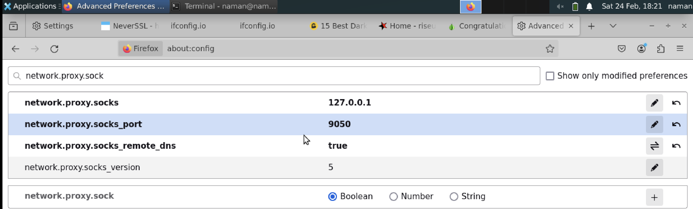
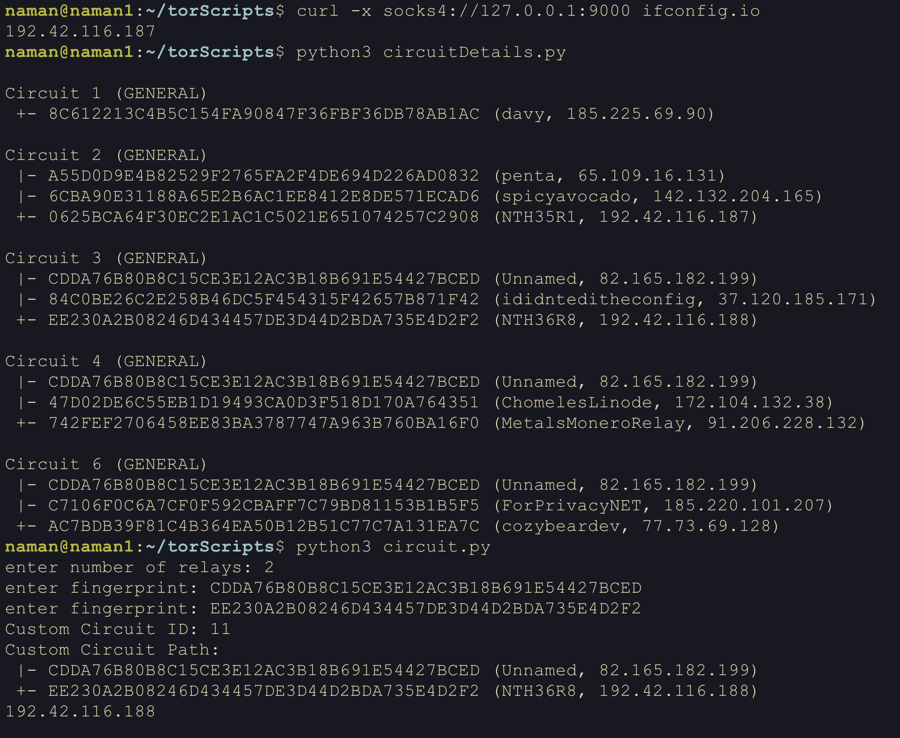



## Introduction

We will setup a tor client and use it to create custom tor circuits. We will use `stem` library to control tor client and create custom tor circuits. We will also use `requests` library to fetch data using the custom tor circuit. We can configure the browser to use tor client through socks proxy and use the custom tor circuit to fetch data.


## Building tor node from source code

- Download source code using `git clone https://github.com/torproject/tor.git`
- Install dependencies using `sudo apt-get libevent-dev libssl-dev zlib1g zlib1g-dev`
- Run `./autogen.sh` to generate `configure` script
- Run `./configure` to generate `Makefile`
- Run `make` to build tor
- Run `make install` to install tor
- Copy sample configuration file to `/usr/local/etc/tor/torrc` using `cp /usr/local/etc/tor/torrc.sample /usr/local/etc/tor/torrc`
- Run tor using `tor`

```bash
git clone https://github.com/torproject/tor.git
sudo apt-get libevent-dev libssl-dev zlib1g zlib1g-dev
./autogen.sh
./configure
make
make install
cp /usr/local/etc/tor/torrc.sample /usr/local/etc/tor/torrc
tor
```

## Configuring browser to use tor
We will use firefox browser to use tor. Change the following settings in firefox browser to use tor.

- setup socks v5 proxy in firefox browser to point to `127.0.0.1:9050`
- Now type `about:config` in firefox browser and change the following settings
	- `network.proxy.socks_remote_dns` to `true`

<!-- image -->


## Setting up custom tor circuit

We can use `stem` library to setup custom tor circuit. The following python script will setup a new arbitary length tor circuit and use it to do ifconfig.io which should return the ip address of the last relay in the circuit. We can match if the ip address is same as the ip address of the last relay in the circuit whose fingerprint we have used to create the circuit.

```python
from stem import CircStatus
from stem.control import Controller
import stem.control
import requests

def build_custom_circuit(controller, relay_fingerprints):
	'''
	relay_fingerprints: list of relay fingerprints
	controller: stem.control.Controller object which is used to control tor
	This function helps to build a custom tor circuit using the given relay_fingerprints and then subsequently returns the circuit_id of the newly created circuit to identify the circuit.
	'''
    circuit_id = controller.new_circuit(path=relay_fingerprints, await_build=True)
    return circuit_id

def get(url="http://ifconfig.io/ip",port=9000):
	'''
	used to fetch the data from the given url using the tor circuit
	'''
	res = requests.get(url, proxies={'http': f'socks4://127.0.0.1:{port}'})
	print(res.text)

def attach_stream(stream):
	'''
	making the stream (i.e. the tcp connections that we will generate) to attach to the custom circuit
	'''
	if stream.status == 'NEW':
		controller.attach_stream(stream.id, circuit_id)
	
def get_url(controller, circuit_id, url, socksPort):
	# add_event_listener is used to attach the stream to the custom circuit, thereby whenever any action happens such as new tcp connection, it will be attached to the custom circuit by calling the attach_stream function
	controller.add_event_listener(attach_stream, stem.control.EventType.STREAM)
	#ensures that the streams are not attached to any circuit by default and we can attach them to the custom circuit
	controller.set_conf('__LeaveStreamsUnattached', '1') 
	# get the url using the custom circuit
	get(url, socksPort)
	# remove the event listener and reset the configuration
	controller.remove_event_listener(attach_stream)
	controller.reset_conf('__LeaveStreamsUnattached')
	

if __name__ == "__main__":
	with Controller.from_port(port=9051) as controller:
		controller.authenticate()

		# First we create the custom circuit by getting the circuit size and the fingerprints of the relays
		# Specify the fingerprints of the desired relays
		relay_fingerprints = [] # ["FINGERPRINT1", "FINGERPRINT2", "FINGERPRINT3"]
		numRelays = int(input("enter number of relays: "))
		for i in range(numRelays):
			relay_fingerprints.append(input("enter fingerprint: "))

		# Build the custom circuit
		circuit_id = build_custom_circuit(controller, relay_fingerprints)

		# Print the details of the custom circuit
		print(f"Custom Circuit ID: {circuit_id}")
		for circ in controller.get_circuits():
			if circ.id == circuit_id:
				print("Custom Circuit Path:")
				for i, entry in enumerate(circ.path):
					div = '+' if (i == len(circ.path) - 1) else '|'
					fingerprint, nickname = entry
					desc = controller.get_network_status(fingerprint, None)
					address = desc.address if desc else 'unknown'
					print(f" {div}- {fingerprint} ({nickname}, {address})")

		url = "http://ifconfig.io/ip"
		socksPort = 9000
		# Get the URL using the custom circuit
		get_url(controller, circuit_id, url, socksPort)
		controller.close()

```

Further we can get details of all the relays in a circuit using the following python script. We can also verify previously created circuit using this script.

```python
from stem import CircStatus
from stem.control import Controller

with Controller.from_port(port = 9051) as controller:
  controller.authenticate()
  # in order to get details of all nodes in network we can use get_network_statuses()
  a = controller.get_network_statuses()
  for i in a:
      print(i)

  # in order to get details of all circuits we can use get_circuits()
  for circ in sorted(controller.get_circuits()):
    if circ.status != CircStatus.BUILT:
      continue

    print("")
    print("Circuit %s (%s)" % (circ.id, circ.purpose))
	# printing each relay in the circuit
    for i, entry in enumerate(circ.path):
      div = '+' if (i == len(circ.path) - 1) else '|'
      fingerprint, nickname = entry

      desc = controller.get_network_status(fingerprint, None)
      address = desc.address if desc else 'unknown'

      print(" %s- %s (%s, %s)" % (div, fingerprint, nickname, address))
```

## Demonstration

- We first fetch the ip address of the last relay in the current circuit then we create a new tor circuit and fetch the ip address of the last relay in the new circuit. We can compare the ip address of the last relay in the new circuit with the ip address of the last relay in the current circuit to verify if the new circuit is created successfully.


```bash
naman@naman1:~/torScripts$ curl -x socks4://127.0.0.1:9000 ifconfig.io
    192.42.116.187

naman@naman1:~/torScripts$ python3 circuit.py
enter number of relays: 2
enter fingerprint: CDDA76B80B8C15CE3E12AC3B18B691E54427BCED
enter fingerprint: EE230A2B08246D434457DE3D44D2BDA735E4D2F2
Custom Circuit ID: 11
Custom Circuit Path:
 |- CDDA76B80B8C15CE3E12AC3B18B691E54427BCED (Unnamed, 82.165.182.199)
 +- EE230A2B08246D434457DE3D44D2BDA735E4D2F2 (NTH36R8, 192.42.116.188)
    192.42.116.188
```
Our script after building the new circuit attaches the stream to the new circuit and does a request to ifconfig.io/ip . We are able to see the ip for the relay we mentioned as exit node while building the circuit. This means our new circuit is created successfully.
<br><br>



<!-- To use newly created tor circuit in the browser, we can delete the default tor circuit and use the newly created tor circuit. The following python script will delete the default tor circuit and use the newly created tor circuit.

```python
from stem.control import Controller

def close_specific_circuit(controller, circuit_id):
    try:
        controller.close_circuit(circuit_id)
        print(f"Circuit {circuit_id} closed successfully.")
    except Exception as e:
        print("Error:", e)

if __name__ == "__main__":
    circuit_id_to_close = input("Enter the ID of the circuit you want to close: ")
	# From the previous script, we can get the circuit id of existing tor circuit by checking the output of whatIsMyIp 
    with Controller.from_port(port=9051) as controller:
        controller.authenticate()
        close_specific_circuit(controller, circuit_id_to_close)
``` -->


## References
- [Chutney](https://blog.gtank.cc/tor-dev-101/)
- [Stem script](https://tor.stackexchange.com/questions/7049/stem-how-to-get-current-in-use-circuit)
